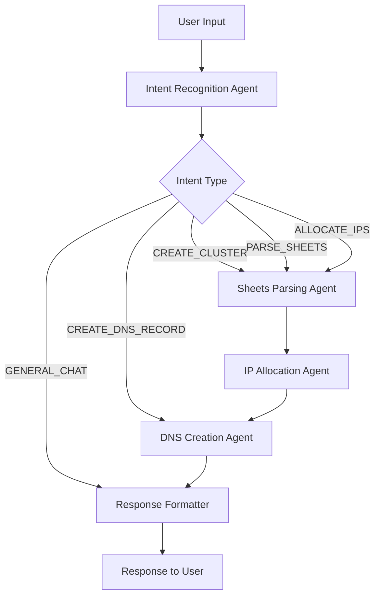

# OpenShift Cluster Manager

AI-powered DNS management for OpenShift clusters with Google Gemini and Infoblox integration.


## 🚀 Overview

OpenShift Cluster Manager is an intelligent conversational application that automates DNS record creation for OpenShift clusters. Using natural language processing powered by Google Gemini, it can parse Google Sheets data, allocate IP addresses, and create DNS records through Infoblox API integration.

## ✨ Features

### 🤖 **Conversational AI Interface**
- Single chat interface powered by Google Gemini 2.0 Flash
- Natural language understanding for different command types
- Intent recognition for automated workflow routing

### 📊 **Google Sheets Integration**
- Parse cluster information from public Google Sheets
- Extract FQDN, subnet, and node console IPs automatically
- Flexible data format handling

### 🔢 **Intelligent IP Allocation**
- Automatic IP allocation from subnet ranges
- Master node allocation (first 3 IPs → master-00, master-01, master-02)
- Worker node allocation (remaining IPs → worker-00, worker-01, etc.)

### 🌐 **DNS Management**
- Infoblox API integration for DNS record creation
- Automatic zone creation if not exists
- Bulk DNS record creation for entire clusters
- Individual DNS record management

### 🔄 **Multi-Agent Architecture**
- LangGraph-powered agent orchestration
- Independent or chained agent execution
- State management between agents

## 🛠 Tech Stack

### Backend
- **FastAPI** - Modern Python web framework
- **Google Gemini 2.0 Flash** - LLM for intent recognition and parsing
- **LangGraph** - Agent workflow orchestration
- **Infoblox Client** - DNS management
- **MongoDB** - Data persistence
- **Motor** - Async MongoDB driver

### Frontend
- **React 19** - Modern React with hooks
- **Tailwind CSS** - Utility-first CSS framework
- **Heroicons** - Icon library
- **Axios** - HTTP client

### Infrastructure
- **MongoDB** - Document database
- **Supervisor** - Process management
- **NGINX** - Reverse proxy (production)

## 📋 Prerequisites

- **Python 3.11+**
- **Node.js 18+**
- **MongoDB**
- **Google Gemini API Key**
- **Infoblox API Access** (optional for testing)

## 🚀 Installation

### 1. Clone the Repository

```bash
git clone <repository-url>
cd openshift-cluster-manager
```

### 2. Backend Setup

#### Install Python Dependencies

```bash
cd backend
python -m venv venv
source venv/bin/activate  # On Windows: venv\Scripts\activate
pip install -r requirements.txt
```

#### Environment Configuration

Create `.env` file in the backend directory:

```env
# Database
MONGO_URL="mongodb://localhost:27017"
DB_NAME="openshift_cluster_db"

# Google Gemini API
GOOGLE_GEMINI_API_KEY="your_gemini_api_key_here"

# Infoblox Configuration
INFOBLOX_HOST="192.168.1.100"
INFOBLOX_USERNAME="admin"
INFOBLOX_PASSWORD="your_password"
INFOBLOX_API_VERSION="v2.5"
DNS_VIEW="default"
```

#### Get Google Gemini API Key

1. Visit [Google AI Studio](https://makersuite.google.com/app/apikey)
2. Create a new API key
3. Add it to your `.env` file

### 3. Frontend Setup

#### Install Node Dependencies

```bash
cd frontend
yarn install
```

#### Frontend Environment Configuration

Create `.env` file in the frontend directory:

```env
REACT_APP_BACKEND_URL=http://localhost:8001
```

### 4. Database Setup

#### Start MongoDB

```bash
# Using Docker
docker run -d -p 27017:27017 --name mongodb mongo:latest

# Or install MongoDB locally
# macOS: brew install mongodb/brew/mongodb-community
# Ubuntu: sudo apt-get install mongodb
```

## 🏃‍♂️ Running the Application

### Development Mode

#### Terminal 1: Start Backend

```bash
cd backend
source venv/bin/activate
uvicorn server:app --host 0.0.0.0 --port 8001 --reload
```

Backend will be available at: `http://localhost:8001`

#### Terminal 2: Start Frontend

```bash
cd frontend
yarn start
```

Frontend will be available at: `http://localhost:3000`

### Production Mode

#### Using Supervisor (Recommended)

1. Install supervisor:
```bash
sudo apt-get install supervisor  # Ubuntu/Debian
# or
brew install supervisor  # macOS
```

2. Configure supervisor (example config):
```ini
[program:backend]
command=/path/to/venv/bin/uvicorn server:app --host 0.0.0.0 --port 8001
directory=/path/to/backend
autostart=true
autorestart=true
user=your_user

[program:frontend]
command=yarn start
directory=/path/to/frontend
autostart=true
autorestart=true
user=your_user
```

3. Start services:
```bash
sudo supervisorctl reread
sudo supervisorctl update
sudo supervisorctl start all
```

## 📖 API Documentation

### Health Check
```bash
GET /api/health
```

### Chat Interface
```bash
POST /api/chat
Content-Type: application/json

{
  "message": "Hey, I want to build new openshift cluster, details are at google sheet <url>",
  "sender": "user"
}
```

### Chat History
```bash
GET /api/chat-history
```

### Operations History
```bash
GET /api/operations
```

## 💬 Usage Examples

### 1. Create OpenShift Cluster
```
Hey, I want to build new openshift cluster, details are at google sheet https://docs.google.com/spreadsheets/d/your-sheet-id/edit
```

**Result**: Parses Google Sheets → Allocates IPs → Creates DNS records → Shows table

### 2. Create Individual DNS Record
```
Hey, can you create a DNS A record for IP 192.168.1.50 and FQDN is node-01.cluster.example.com
```

**Result**: Creates single DNS record

### 3. Parse Google Sheets
```
Hey, can you parse google sheet at <url> and provide FQDN and subnet and list console IPs of the nodes
```

**Result**: Extracts and displays cluster information

### 4. Allocate IPs
```
Hey, allocate IPs for all the nodes listed in google sheet <url> with the subnet
```

**Result**: Shows IP allocation table with subnet mapping

## 🏗 Architecture

### Agent Workflow



### Component Structure

```
/app
├── backend/
│   ├── server.py              # Main FastAPI application
│   ├── requirements.txt       # Python dependencies
│   └── .env                   # Environment variables
├── frontend/
│   ├── src/
│   │   ├── App.js            # Main React component
│   │   ├── App.css           # Styles
│   │   └── index.js          # Entry point
│   ├── package.json          # Node dependencies
│   └── .env                  # Frontend environment
└── README.md                 # This file
```

## 🔧 Configuration

### Google Sheets Format

Your Google Sheets should contain:
- **FQDN**: Cluster domain name
- **Subnet**: Network subnet in CIDR format
- **Console IPs**: List of IP addresses for nodes

Example CSV structure:
```csv
FQDN,Baremetal subnet,Console IPs
cluster.example.com,10.0.0.0/16,"10.1.0.2,10.1.0.3,10.1.0.4"
```

### IP Allocation Logic

- **Master Nodes**: First 3 IPs from subnet
  - `master-00.<fqdn>` → First IP
  - `master-01.<fqdn>` → Second IP  
  - `master-02.<fqdn>` → Third IP

- **Worker Nodes**: Remaining IPs
  - `worker-00.<fqdn>` → Fourth IP
  - `worker-01.<fqdn>` → Fifth IP
  - And so on...

## 🐛 Troubleshooting

### Common Issues

#### 1. Google Gemini API Errors
```bash
# Check API key
curl -H "Authorization: Bearer YOUR_API_KEY" https://generativelanguage.googleapis.com/v1/models
```

#### 2. MongoDB Connection Issues
```bash
# Check MongoDB status
sudo systemctl status mongod
# or
docker ps | grep mongo
```

#### 3. Google Sheets Access
- Ensure sheet is publicly accessible
- Check sharing settings: "Anyone with the link can view"

#### 4. Backend Not Starting
```bash
# Check logs
tail -f /var/log/supervisor/backend.*.log
```

### Environment Variables Check

```bash
# Backend
cd backend && python -c "
import os
from dotenv import load_dotenv
load_dotenv()
print('MONGO_URL:', os.getenv('MONGO_URL'))
print('GOOGLE_GEMINI_API_KEY:', 'SET' if os.getenv('GOOGLE_GEMINI_API_KEY') else 'MISSING')
"

# Frontend
cd frontend && node -e "
require('dotenv').config();
console.log('REACT_APP_BACKEND_URL:', process.env.REACT_APP_BACKEND_URL);
"
```

## 🤝 Contributing

1. Fork the repository
2. Create feature branch: `git checkout -b feature/amazing-feature`
3. Commit changes: `git commit -m 'Add amazing feature'`
4. Push to branch: `git push origin feature/amazing-feature`
5. Open Pull Request

## 📝 License

This project is licensed under the MIT License - see the [LICENSE](LICENSE) file for details.

## 🙏 Acknowledgments

- **Google Gemini** for powerful LLM capabilities
- **Infoblox** for DNS management APIs
- **LangGraph** for agent workflow orchestration
- **React** and **FastAPI** communities

## 📞 Support

For support and questions:
- Create an issue in the repository
- Check the troubleshooting section
- Review API documentation

---

**Built with ❤️ for OpenShift administrators**